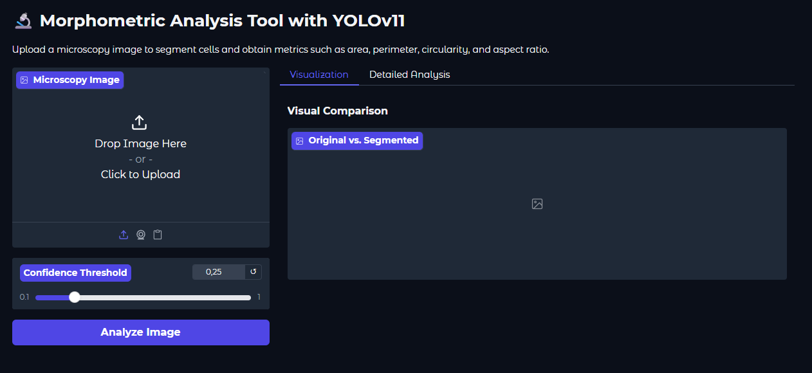
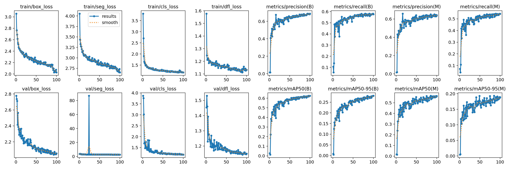
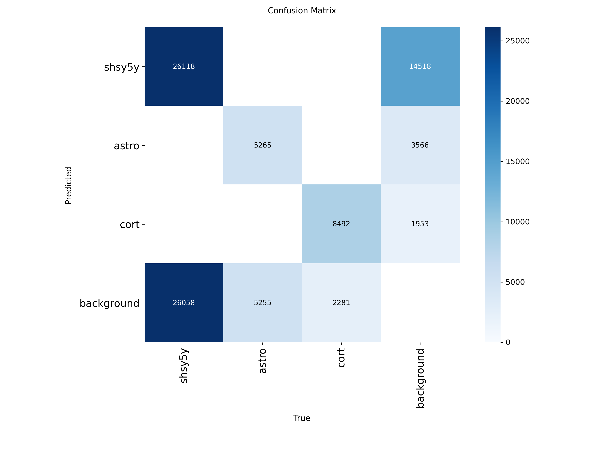
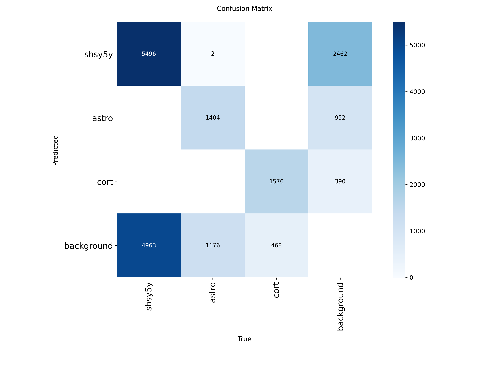

# Cell Instance Segmentation and Morphometric Analysis with YOLO11

   

Instance segmentation and quantitative morphometric analysis system for neurological cells using **YOLO11**, with interactive web application for automated scientific analysis.

👉 **[🔬 Access the Live Application Here](https://huggingface.co/spaces/alicefvictorino/cell-segmentation-app)** 🚀

<p align="center">
  
</p>

`YOLO` • `segmentation` • `morphometric analysis` • `neuroscience` • `gradio` • `hugging face` • `microscopy`

## 📑 Table of Contents

- [Objective](#-objective)
- [Technologies Used](#️-technologies-used)
- [Results and Analysis](#-results-and-analysis)
- [Application Features](#-application-features)
- [About the Dataset](#-about-the-dataset)
- [License](#-license)

## 🎯 Objective

Manual analysis of microscopy images for cell identification and quantification is a **slow, subjective, and error-prone** process. This project offers an automated solution that aims to **automatize** individual cell detection and segmentation, and **extracts quantitative metrics** from images, such as area and perimeter (in pixels), circularity and elongation.

## 🛠️ Technologies Used

- **YOLO11-seg** - Instance segmentation model
- **PyTorch** - Deep learning framework
- **Ultralytics** - YOLO library
- **OpenCV** - Image processing
- **Pandas & NumPy** - Data analysis
- **Matplotlib** - Visualization
- **Gradio** - Interactive web interface
- **Hugging Face Spaces** - Deployment platform
- **Google Colab** - Training environment


## 📊 Results and Analysis

To validate the model's effectiveness, an iterative training process was conducted. An initial baseline model was trained for 25 epochs, followed by a refined model trained for 100 epochs on a properly split dataset (80% train, 20% validation). The comparison clearly demonstrates the significant impact of longer, more structured training.

### Model Performance Comparison

The evaluation on the validation set shows a substantial improvement in the refined model across all key metrics.

| Metric | Baseline Model (25 Epochs) | Refined Model (100 Epochs) | Improvement |
| :--- | :--- | :--- | :--- |
| **mAP50-95(M)** | 0.17 | **0.28** | **+65%** |
| **mAP50(M)** | 0.52 | **0.62** | **+19%** |

-   **mAP50-95(M):** This  metric evaluates the precise quality of the mask overlap, saw **65% increase**, moving from 0.17 to 0.28. This indicates that the refined model's masks are significantly more accurate.
-   **mAP50(M):** With a more flexible overlap criterion, the refined model correctly segments over 62% of the cells, a 10-point improvement.

The training graphs below illustrate the stable learning process of the 100-epoch model, with consistently decreasing loss curves and ascending mAP curves.

<p align="center">
  
  <br>
  <em>Loss and precision graphs during the 100-epoch training run.</em>
</p>

### Qualitative and Classification Analysis

A comparison of the confusion matrices reveals the most significant improvement. The refined model is more effective at correctly identifying cell types and reduces the number of missed cells (false negatives classified as `background`).

| Baseline Model (25 Epochs) | Refined Model (100 Epochs) |
| :---: | :---: |
|  |  |

-   **Reduction in Missed Detections:** The number of true cells misclassified as `background` dropped from **33,594** (26058+5255+2281) in the 25-epoch model to just **6,607** (4963+1176+468) in the 100-epoch model. This is a **~80% reduction in false negatives**, proving the refined model is vastly superior at finding cells.
-   **Improved Classification Accuracy:** The diagonal of the 100-epoch matrix is much "cleaner," indicating fewer mistakes between cell types once they are detected.

A visual comparison of the predictions further confirms this improvement. The 100-epoch model not only detects more cells, particularly in dense clusters, but also generates tighter and more accurate segmentation masks.


### Morphometric Analysis

The developed application automatically calculates the following metrics for each segmented cell, allowing for objective scientific analysis:

-   **Cell Area** (in pixels²)
-   **Contour Perimeter** (in pixels)
-   **Circularity** (a measure from 0 to 1 indicating how "round" the cell is)
-   **Aspect Ratio** (measures cell elongation)

### Future Work and Potential Improvements

While the current model provides a good baseline, several improvements can be done for further enhancement.

1.  **Model Scaling:**
    -   The most direct path to higher accuracy is to train a larger model from the YOLO11 family, such as **`yolo11s-seg.pt`** or **`yolo11m-seg.pt`**. This involves a trade-off, as larger models require more training time but typically yield more precise segmentation masks.

2.  **Advanced Data Augmentation:**
    -   To improve model robustness, especially for irregular cell shapes, more advanced augmentation techniques specific to microscopy can be implemented. This includes **Elastic Deformation** and **Grid Distortion**, which simulate the natural, non-rigid variations found in biological samples.

3.  **Hyperparameter Tuning:**
    -   A systematic search for optimal training hyperparameters (e.g., learning rate, weight decay, augmentation parameters) could be conducted using tools like Ray Tune or Optuna. This can lead to significant performance gains by finding the best configuration for this specific dataset.

4.  **Post-processing of Masks:**
    -   A post-processing step could be added to the `analysis.py` script to "clean up" the predicted masks. Using **OpenCV's morphological operations** (like `cv2.morphologyEx` with `MORPH_OPEN`) can remove small, noisy detections and smooth the contours of the main cell bodies, leading to more accurate morphometric data.

5.  **Enhanced Scientific Analysis:**
    -   The morphometric analysis can be expanded to perform statistical tests (e.g., t-tests or ANOVA) to quantitatively determine if the differences in area or circularity between cell types are statistically significant. Visualizations could also be enhanced with violin plots to better show the distribution of features.


## 🔍 Application Features

The deployed Gradio application includes:
- Upload microscopy images
- Automatic cell segmentation
- Visualization of masks and bounding boxes
- Real-time morphometric analysis

<!-- 
## ⚙️ How to Run

### Option 1: Google Colab (Recommended)

#### 1. Clone Repository
```python
!git clone https://github.com/your-username/cell-instance-segmentation.git
%cd cell-instance-segmentation
!pip install -r requirements.txt
```

#### 2. Mount Google Drive
```python
from google.colab import drive
drive.mount('/content/drive')

# Create necessary folders in your Drive
!mkdir -p "/content/drive/MyDrive/Cell_Project"
```

#### 3. Configure Data
```python
# Define your Google Drive paths
raw_data = "/content/drive/MyDrive/Cell_Project/raw_data"
processed_data = "/content/drive/MyDrive/Cell_Project/yolo_dataset"
training_results = "/content/drive/MyDrive/Cell_Project/results"

# Place your raw data in the raw_data folder in Drive
# Including: train.csv, sample_submission.csv and train/ and test/ folders
```

#### 4. Preprocessing
```python
!python scripts/preprocess.py \
  --raw_data_dir "{raw_data}" \
  --output_dir "{processed_data}"
```

#### 5. Training
```python
!python scripts/train.py \
  --data_dir "{processed_data}" \
  --project_dir "{training_results}" \
  --epochs 100
```

#### 6. Results Analysis
```python
trained_model = f"{training_results}/yolov11n_seg_100_epochs/weights/best.pt"
test_image = f"{raw_data}/test/example.png"

!python scripts/analysis.py \
  --model_path "{trained_model}" \
  --image_path "{test_image}"
```

### Option 2: Local Execution

```bash
# 1. Clone repository
git clone https://github.com/your-username/cell-instance-segmentation.git
cd cell-instance-segmentation

# 2. Install dependencies
pip install -r requirements.txt

# 3. Run preprocessing
python scripts/preprocess.py --raw_data_dir "./data" --output_dir "./data/yolo_dataset"

# 4. Train model
python scripts/train.py --data_dir "./data/yolo_dataset" --project_dir "./runs" --epochs 100

# 5. Run analysis
python scripts/analysis.py --model_path "./runs/train/weights/best.pt" --image_path "./data/test/example.png"
``` -->

## 📚 About the Dataset

This project uses the **Sartorius Cell Instance Segmentation Dataset**, available on Kaggle, which contains:
- 🔬 **High-quality microscopy images**
- 🏷️ **RLE annotations** for instance segmentation
- 🧬 **Multiple neurological cell types**
- 📊 **Well-structured training and test data**


## 📄 License

This project is licensed under the **MIT License** - see the [LICENSE](LICENSE) file for details.

## References

-   **Sartorius - Cell Instance Segmentation (Kaggle Competition):**
    Howard, A., Chow, A., et al. (2021). *Sartorius - Cell Instance Segmentation*. Kaggle. Retrieved from https://kaggle.com/competitions/sartorius-cell-instance-segmentation
-   **Ultralytics YOLOv11 Documentation:**
    -   Models: https://docs.ultralytics.com/pt/models/yolo11/
    -   Segmentation Task: https://docs.ultralytics.com/pt/tasks/segment/#models


