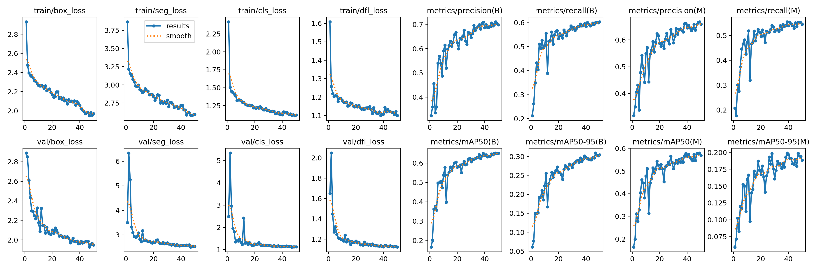
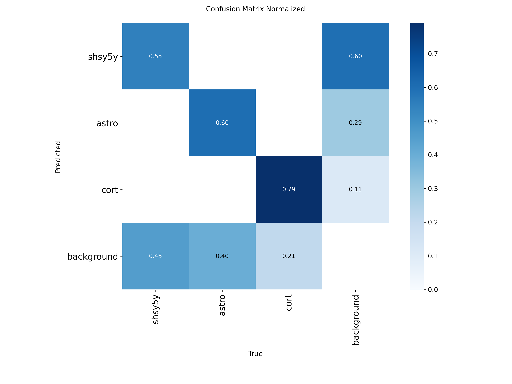

# Cell Instance Segmentation and Morphometric Analysis with YOLO11

   


## 🚀 Interactive Application

👉 **[🔬 Access the Live Application Here](https://cell-segmentation.streamlit.app/)** 🚀


## 📑 Table of Contents
- [Objective](#-objective)
- [How to Run](#-how-to-run)
- [Project Structure](#-project-structure)
- [Results and Analysis](#-results-and-analysis)
- [Technologies Used](#️-technologies-used)
- [About the Dataset](#-about-the-dataset)
- [License](#-license)
- [References](#-references)

## 🎯 Objective

Manual analysis of microscopy images for cell identification and quantification is a **slow, subjective, and error-prone** process. This project provides an automated solution for:
* Individual cell detection and instance segmentation.
* Extraction of quantitative morphological metrics (e.g., area, perimeter, circularity, aspect ratio) from segmented cells.

## 🚀 How to Run

This project includes a reproducible workflow using a single Jupyter Notebook. This is the **recommended way to run the entire pipeline**, from data download to model training.

[](https://colab.research.google.com/github/alicefvictorino/cell-instance-segmentation/blob/main/main_workflow_kaggle.ipynb)

**Click the button above to open the `main_workflow_kaggle.ipynb` notebook in Google Colab.**

This automated workflow will:
1.  **Clone the repository** and install all required dependencies.
2.  **Handle Kaggle API authentication** to securely access the dataset.
3.  **Download and preprocess the data** directly from Kaggle.
4.  **Train the `yolo11s-seg` model** for 50 epochs.
5.  **Save the final model** and all training results to your personal Google Drive for persistence.

## 📂 Project Structure

```
cell-instance-segmentation/
├── 📁 app/
│   ├── app.py          # Main script for the Streamlit web interface.
│   └── best.pt         # Trained YOLO11s-seg model used by the application.
├── 📁 assets/
│   └── streamlit_app_screenshot.png # Screenshot of the Streamlit application
│   └── results_training_graphs.jpg  # Training performance graphs
│   └── confusion_matrix.png         # Normalized confusion matrix
├── 📁 scripts/
│   ├── preprocess.py   # Converts RLE annotations to YOLO format
│   ├── train.py        # Trains the YOLO model
│   └── analysis.py     # Performs morphometric analysis on segmented cells
├── main_workflow_kaggle.ipynb  # The reproducible workflow for the pipeline
├── requirements.txt      # Python dependencies for the project
└── README.md      
└── LICENSE      
```


## 📊 Model Performance

The `yolo11s-seg` model was trained for instance segmentation on microscopy images. Training focused on optimizing mask prediction accuracy and cell classification.

The following metrics represent the model's performance on the validation set after training:

| Metric          | YOLO11s-seg Performance |
| :-------------- | :----------------------- |
| **mAP50-95(M)** | **0.334**                |
| **mAP50(M)**    | **0.638**                |

-   **mAP50-95(M) (Mean Average Precision @ 0.50-0.95 IoU for Masks):** **0.334**. This metric evaluates mask quality across various Intersection over Union (IoU) thresholds, from a loose 0.50 to a strict 0.95. A higher value indicates better mask prediction precision.
-   **mAP50(M) (Mean Average Precision @ 0.50 IoU for Masks):** **0.638**. This metric specifically assesses mask overlap at an IoU threshold of 0.50. A value of **0.638** indicates that, with a 50% overlap criterion, the model correctly segments over 63% of the cells.

The training graphs below illustrate the model's learning process, showing decreasing loss curves and increasing mAP curves over epochs.

<p align="center">
  
  <br>
  <em>Loss and precision graphs during the YOLO11s-seg training run.</em>
</p>

### Qualitative and Classification Analysis

The confusion matrix provides insight into the model's classification performance:

<p align="center">
  
</p>

-   **False Negatives (Missed Detections):** The matrix indicates a low rate of true cells being misclassified as `background`, demonstrating the model's effectiveness in detecting cells.
-   **Classification Accuracy:** The diagonal elements of the matrix show a high proportion of correctly classified cells across different types, indicating robust inter-class distinction.

## 🛠️ Technologies Used

- **YOLO11s-seg** - Segmentation model
- **PyTorch** - Deep learning framework
- **Ultralytics** - YOLO library
- **OpenCV** - Image processing
- **Pandas & NumPy** - Data analysis
- **Plotly & Matplotlib** - Visualization
- **Streamlit** - Interactive web interface
- **Streamlit Community Cloud** - Deployment platform
- **Google Colab** - Training environment


## 📚 About the Dataset

This project uses the **Sartorius Cell Instance Segmentation Dataset**, available on Kaggle, which contains:
- 🔬 **High-quality microscopy images**
- 🏷️ **RLE annotations** for instance segmentation
- 🧬 **Multiple neurological cell types**
- 📊 **Well-structured training and test data**

## 👥 Project Team

The development of the project was conducted for the Computer Vision course, taught by Professor [Helton Maia](https://heltonmaia.com/) at ECT/UFRN.


 | [](https://github.com/alicefvictorino) | [](https://github.com/heltonmaia) |
 | :---------------------------------------------------------------------------------------: | :-----------------------------------------------------------------------------: |
 |                             **alicefvictorino** Researcher                              |                       **heltonmaia**  Supervising Professor                     |

---

## 📄 License

This project is licensed under the **MIT License**. See the [LICENSE](LICENSE) file for details.


## References

-   **Sartorius - Cell Instance Segmentation (Kaggle Competition):**
    Howard, A., Chow, A., et al. (2021). *Sartorius - Cell Instance Segmentation*. Kaggle. Retrieved from https://kaggle.com/competitions/sartorius-cell-instance-segmentation
- https://docs.ultralytics.com/tasks/segment/
